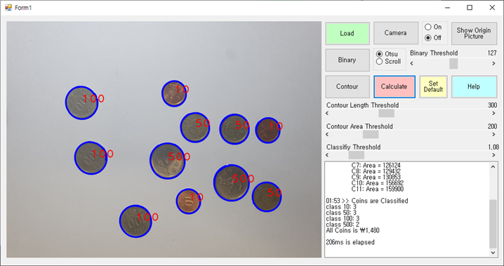
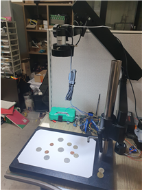

# Coin_Labeller
## Brief
이 프로젝트는 동전들이 있는 사진을 촬영하여 업로드하면 자동으로 총 금액을 계산해주는 프로그램입니다.  
ML을 사용하지 않고 순수한 영상처리만으로 설계하였기 때문에, 제약이 있습니다.  
서울과학기술대학교의 PC기반 제어 프로그래밍 수업의 텀 프로젝트로 제작되었습니다.


### Dependancy
||
|--|
OpenCvSharp3-AnyCPU


## 조건
1. 동전이 겹쳐서 촬영되지 않아야 합니다.
2. 강한 반사광은 성능 저하를 일으켜 정확한 추산이 불가능합니다. 배경과 명도차이가 클 수록 성능이 좋아집니다.
3. 이 프로그램은 동전의 상대적인 크기를 비교하여 계산하기 때문에 반드시 10원, 50원, 100원, 500원짜리 동전이 모두 사진 상에 존재하여야합니다.
## 실험환경


## 장점
1. 미리 동전의 면적을 계산시키는 티칭과정이 필요하지 않습니다.
2. 최적 threshold가 계산되어 있기 때문에 주변 광원 조건이 크게 다르지 않다면 바로 계산이 가능합니다.

<br/>

## 동전 분류 알고리즘
```C
for(i = 0 to end of contour list)
   if(Area[i] * a == TRUE)    //  a > 1
       then, Area[i] and Area[i+1] is same class
   else
        Area[i] and Area[i+1] is different class
```
Area[i]에 1보다 큰 threshold인 a를 곱한 것보다 Area[i+1]이 작다면 이 둘은 같은 Class(종류)로 생각할 수 있습니다. 만약 둘 사이의 면적 비가 갑자기 커진다면 이 둘은 다른 Class로 분류할 수 있고 이 둘 사이를 기준으로 Class를 나누면 됩니다.
## 계산 알고리즘
```C#
private void btn_Cal_Click(object sender, EventArgs e)
{
    if(OriginIm == null)
    {
        println("Calculate failed, Please load image");
        return;
    }
    DateTime start = DateTime.Now;
    btn_Contour.PerformClick();
    if (Contours.Count == 0) // avoid exception
    {
        println("Contour Failed, please readjust thresholds!");
        return;
    }
```
9번째 줄로 이진화 -> 컨투어 함수를 한꺼번에 실행시킨 뒤 계산 과정에 들어가게 됩니다.
만약 원본 이미지가 로드되지 않았거나 컨투어 과정에서 아무것도 검출하지 못하였다면 null reference
exception을 막기 위해 경고 메시지를 출력하고 return 하게 됩니다.
아래쪽 코드, 16번째 줄에서는 라벨을 pixture box에 같이 편리하게 출력하기 위해서 미리 동전 숫자를
string 배열로 선언하고, 17번째 줄에서 분류된 컨투어들이 들어갈 리스트 배열을 선언해줍니다.
18번째 줄에서는 리스트 배열 내부를 초기화해줍니다.

```C#
int idx, class_idx = 0;
    string[] cname = { "10", "50", "100", "500" };
    List <OpenCvSharp.Point[]>[] classified = new List <OpenCvSharp.Point[]>[4];
    for (idx = 0; idx < 4; idx ++) classified[idx] = new List <OpenCvSharp.Point[]>();
 
    classified[0].Add(Contours[0]); // minimum size is always class 0
    for (idx = 1; idx < Contours.Count; idx ++)
    {
        // List Countours is already sored by area
        double a = Cv2.ContourArea(Contours[idx - 1], true);
        double b = Cv2.ContourArea(Contours[idx], true);
        if (a * (hsc_Class.Value / 100d) > b)
            classified[class_idx % 4].Add(Contours[idx]); // avoid exception
        else
        {
            classified[++class_idx % 4].Add(Contours[idx]);
        }
    }
```
20번째 줄에서는 필터를 거친 검출된 컨투어 중에서 가장 면적이 작은 컨투어 하나를 Class(분류) 0에 미리
넣습니다. (처음 객체는 비교할 필요가 없기 때문)
21번째 줄부터는 바로 그 다음 크기의 컨투어와 비교를 하게 됩니다. 26번째 줄에서 스크롤바는 움직이는
최소 단위가 1이기 때문에, 100을 곱한 값을 쓰고 함수에서 쓸 때는 100 (double형)을 나눠서 사용합니다.
적정값을 곱한 값보다 그 다음 컨투어의 값이 작다면 같은 분류로 인지하여 같은 배열에 집어넣습니다.
그렇지 않을 경우 그 다음 인덱스의 분류로 집어넣게 됩니다.
27번째 줄에 moduler 연산이 되어 있는 것은 분류에 실패하여 3보다 큰 index에 객체를 집어 넣으려고 하여
프로그램이 의도치 않게 종료되는 out of index exception을 피하기 위해 사용하였습니다.

```C#
    // Write classification at Centroid 
    for(class_idx = 0; class_idx < 4; class_idx ++)
    {
        foreach(OpenCvSharp.Point[] p in classified[class_idx])
        {
            Moments moments = Cv2.Moments(p, false);
            int x = (int)(moments.M10 / moments.M00);
            int y = (int)(moments.M01 / moments.M00);
            Cv2.PutText(ContourIm, cname[class_idx], new OpenCvSharp.Point(x, y), HersheyFonts.HersheyPlain, 10, new Scalar(0, 0, 255), 10, LineTypes.AntiAlias);
        }
    }
    pic.Image = ContourIm.ToBitmap();
```

Cv2.Moments 함수를 이용하여 컨투어의 1차 모멘트를 계산하여 M00 (면적)로 나누어 무게중심 좌표의
위치를 찾는다. 하지만 이 좌표는 본래 이미지인 Mat의 좌표이기 때문에 PixtureBox에 그리면 안되고 Mat에 직접	그려야하기 때문에 Cv2.PutText 함수를 사용하여 무게중심에 라벨 문자를 입력하고 이미지를 출력한다.

```C#
// calculate sum of coin in won
    int _10 = classified[0].Count;
    int _50 = classified[1].Count;
    int _100 = classified[2].Count;
    int _500 = classified[3].Count;
    int sum = _10 * 10 + _50 * 50 + _100 * 100 + _500 * 500;
    string st = "Coins are Classified\r\n";
    st += "class  10: " + _10.ToString("D2") + "\r\n";
    st += "class  50: " + _50.ToString("D2") + "\r\n";
    st += "class 100: " + _100.ToString("D2") + "\r\n";
    st += "class 500: " + _500.ToString("D2") + "\r\n";
    st += "All Coins is " + sum.ToString("C", CultureInfo.CurrentCulture);
    println(st + "\r\n\r\n" + DateTime.Now.Subtract(start).Milliseconds.ToString() + "ms is elapsed");
}
```
최종적으로 각 분류된 클래스 배열 내의 객체 수를 세어 각 동전의 금액에 맞게 곱해준 다음 모두 더해준다.
Text Box에 출력할 최종 결과를 st 객체에 저장한 뒤에 마지막에 계산 시작부터 종료까지 걸린 시간과 함께
출력하여줍니다.